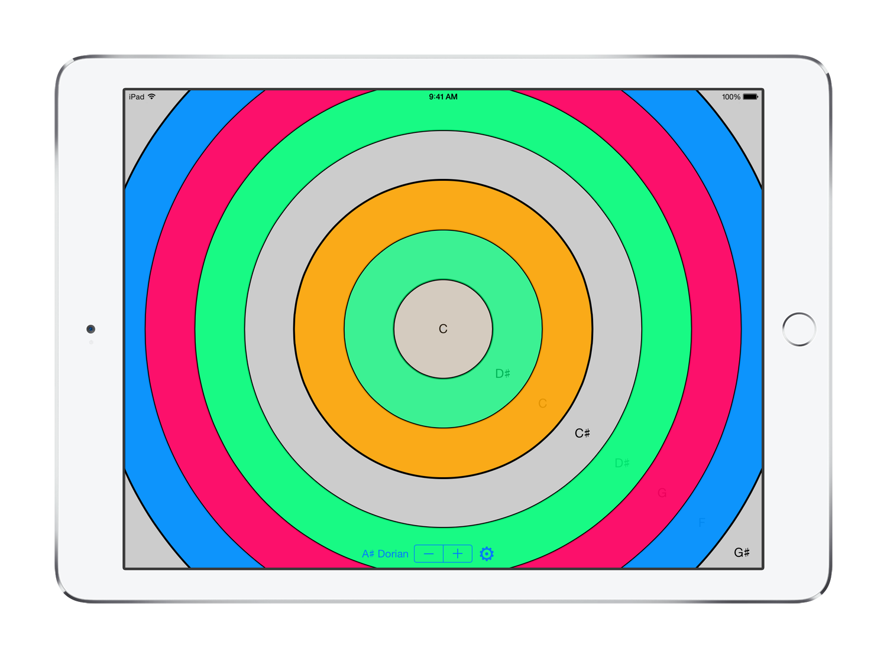
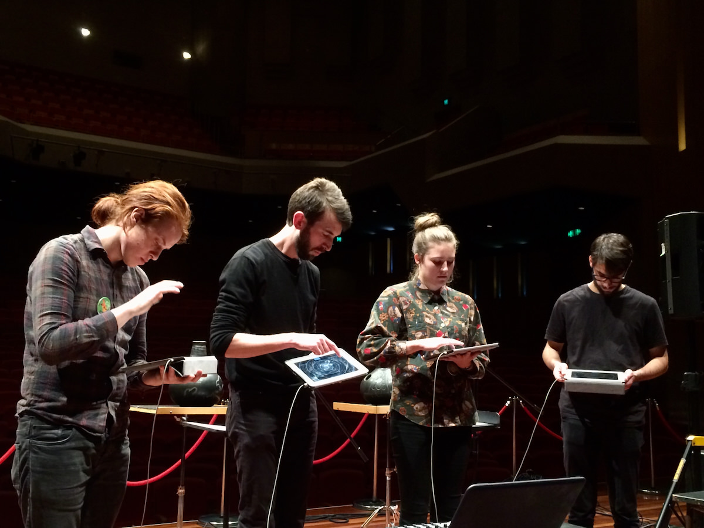
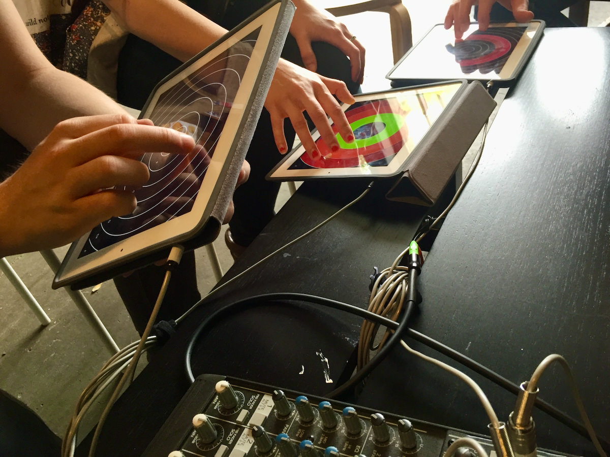

# PhaseRings

[Available in the App Store for iPad and iPhones][(https://itunes.apple.com/app/phaserings/id924795988)

## touchscreen app for creative music making

PhaseRings is a musical instrument for performing expressive music with touch gestures on iOS. The app creates sequences of randomly generated circular sound setups with notes taken from interesting scales and modes.

Each ring on the screen represents a different pitch, and you can tap and swirl on each ring to create combinations of long and short notes. The angle and size of your tap will change the timbre of the notes you create!

PhaseRings includes seven expressive sound schemes featuring percussive sounds like marimba and singing bowls as well as pure synth sounds like phase and string synthesis.

Three compositions of pitches are included in the app, but you can also create your own custom composition by choosing three base notes and scales, PhaseRings will do the rest, generating a series of great setups from the harmony you choose!

## features

- 7 sound schemes
- 3 built-in setups
- Custom generative composition
- 11 scales and modes
- AUv3 instrument plugin to play PhaseRings inside compatible hosts
- Core MIDI support for iOS MIDI Accessories

## performance

PhaseRings has been used in improvised and experimental performances around the world. Charles Martin performed with PhaseRings in [quartet improvisations](https://youtu.be/aDEQMLwd8ok) and with other instruments as in the [Colour Music](https://charlesmartin.bandcamp.com/album/colour-music) album.

## research

PhaseRings was originally developed as part of Charles Martin's research into group music making with networked devices. It was applied in research from 2014--2017 and featured in the following publications:

- Charles Patrick Martin, Kai Olav Ellefsen, and Jim Torresen. 2017. Deep Models for Ensemble Touch-Screen Improvisation. Proceedings of the 12th International Audio Mostly Conference on Augmented and Participatory Sound and Music Experiences. <http://doi.org/10.1145/3123514.3123556>
- Charles Patrick Martin. 2017. Percussionist-Centred Design for Touchscreen Digital Musical Instruments. Contemporary Music Review 36, 1–2, 64–85. <http://doi.org/10.1080/07494467.2017.1370794>
- Charles P. Martin. 2016. PhaseRings for iPad Ensemble and Ensemble Director Agent. Musical Program of the International Conference on Auditory Display, pp. 232–233. <http://www.icad.org/icad2016/proceedings/concert/ICAD2016_paper_99.pdf>
- Charles Martin, Henry Gardner, Ben Swift, and Michael Martin. 2016. Intelligent Agents and Networked Buttons Improve Free-Improvised Ensemble Music-Making on Touch-Screens. Proceedings of the SIGCHI Conference on Human Factors in Computing Systems, ACM, pp. 2295–2306. <http://doi.org/10.1145/2858036.2858269>
- Charles Martin, Henry Gardner, and Ben Swift. 2015. Tracking Ensemble Performance on Touch-Screens with Gesture Classification and Transition Matrices. Proceedings of the International Conference on New Interfaces for Musical Expression, Louisiana State University, pp. 359–364. <http://doi.org/10.5281/zenodo.1179130>
- Charles Martin and Henry Gardner. 2015. That Syncing Feeling: Networked Strategies for Enabling Ensemble Creativity in iPad Musicians. Proceedings of CreateWorld, Griffith University. <http://hdl.handle.net/1885/95216>

